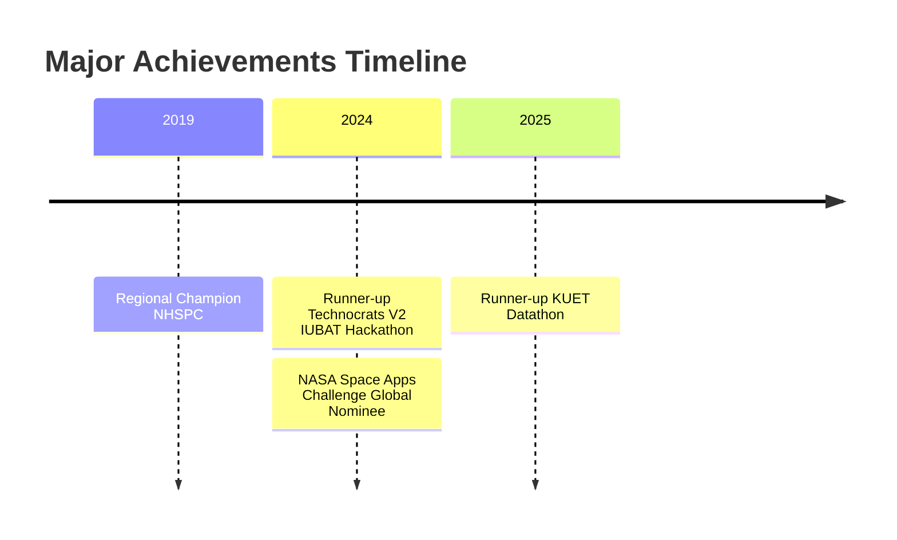

  
  

  

  

# 👨‍💻 About Me

I'm a passionate researcher and engineer at the **Robotics and Mechatronics Engineering Department, University of Dhaka**. Currently working on multiple fronts:

🔬 **Research Intern** at CARS (Centre for Advanced Research in Sciences)  
🛠️ **R&D Engineer** at Tech Topia  
🚀 **Team Lead** of The Automation of X Rover Team  
📊 **Kaggle Expert** with a focus on AI and ML

  

# 🔬 Research Projects

<table align="center">
  <tr>
    <td align="center">
      
       
      <b>Human Detection in Disaster Scenarios</b>
       
      <i>With Dr. Mehedi Hassan</i>
    </td>
    <td align="center">
      
       
      <b>Sugarcane Leaf Disease Prediction</b>
       
      <i>With Shifat E Arman</i>
    </td>
    <td align="center">
      
       
      <b>Drone Based Climate Mitigation</b>
       
      <i>With Dr. Shamim Ahmed Deowan</i>
    </td>
  </tr>
</table>

  

# 🏆 Competitions & Achievements

## 🎯 Upcoming Competitions
- 🌟 **MIT Solve**
- 💻 **MIST Hackathon**
- 🌐 **WSDM Cup - Multilingual Chatbot Arena**

  

# 📊 GitHub Analytics

  
  

  

# 🔗 Connect With Me

  
  
  
  
  
  

  

