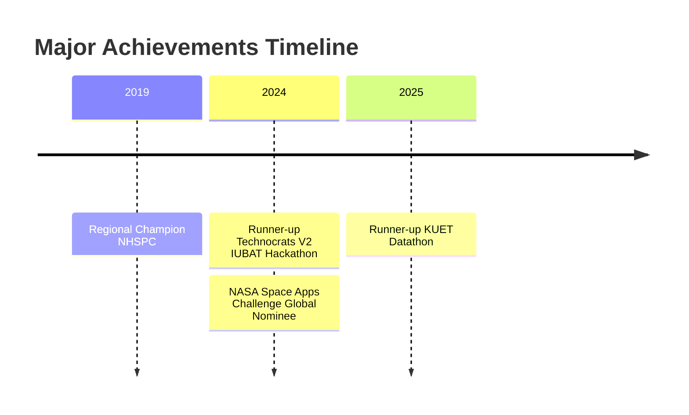

  

# 👨‍💻 About Me

I'm a passionate researcher and student at the **Robotics and Mechatronics Engineering Department, University of Dhaka**. Currently working on multiple fronts:  

- **Undergrad** at **Robotics and Mechatronics Engineering**, DU
- 🔬 **Research Intern** at **Data and Design Lab, CARS (Centre for Advanced Research in Sciences)**  
- 🛠️ **R&D Engineer** at **Tech Topia**  
- 🚀 **Team Lead** of **The Automation of X Rover Team**  
- 📊 **Kaggle Expert** & Active Competitor at **Kaggle Competitions**  

  

# 🛠️ Skills & Technologies

  <table border="0" cellspacing="0" cellpadding="0">
    <tr>
      <td>
        <b> Languages</b>
      </td>
      <td>
        <b> Frameworks</b>
      </td>
    </tr>
    <tr>
      <td>
        
        
        
        
      </td>
      <td>
        
        
        
        
      </td>
    </tr>
    <tr>
      <td>
        <b> ML Tools</b>
      </td>
      <td>
        <b> DevOps</b>
      </td>
    </tr>
    <tr>
      <td>
        
        
        
      </td>
      <td>
        
        
        
      </td>
    </tr>
  </table>

  

# 🔗 Connect With Me

  
  
  
  
  

  

# 🔬 Research Projects
<table align="center">
  <tr>
    <td align="center">
       
      <b>Human Detection in Disaster Scenarios</b>
       
      <i>With Dr. Mehedi Hassan</i>
    </td>
    <td align="center">
       
      <b>Sugarcane Leaf Disease Prediction</b>
       
      <i>With Shifat E Arman</i>
    </td>
    <td align="center">
       
      <b>Drone Based Climate Mitigation</b>
       
      <i>With Dr. Shamim Ahmed Deowan</i>
    </td>
  </tr>
</table>

  

# 🏆 Competitions & Achievements

## 🎯 Upcoming Competitions
- 🌟 MIT Solve
- 💻 Harvard HSIL Hackathon
- 💻 BRAC AI Hackathon
- 💻 CUET Techatron Hackathon
- 🌐 WSDM Cup - Multilingual Chatbot Arena
  

  

# 📊 GitHub Analytics

  
  

  

  

